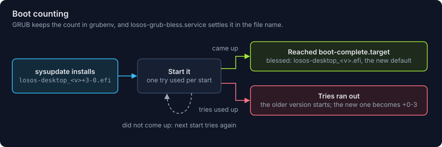

# Boot loaders

LosOS boots with systemd-boot on UEFI, and with GRUB on an x86_64 PC that
starts by legacy BIOS (or by UEFI's Compatibility Support Module, with UEFI
turned off). One disk carries both, so the same image, the same install and
the same updates start on either kind of firmware. arm64 has no BIOS, and
nothing here applies to it.

```
UEFI   firmware -> ESP: systemd-boot -> the newest UKI
BIOS   firmware -> MBR: GRUB's boot.img -> BIOS boot partition: GRUB's core
              -> the newest UKI's kernel, initrd and command line
```


Both start the same initrd and the same system, find the same versions on
the ESP, count the tries of a new one, and fall back to the older one, so the
two `/usr` slots and rollback work the same under either.

## What is on the disk

```
MBR, first 440 bytes                GRUB's boot.img (UEFI ignores it)
BIOS boot partition, 1 MiB          GRUB's core.img, its modules and menu inside
ESP
  EFI/BOOT/BOOTX64.EFI              systemd-boot
  EFI/systemd/systemd-bootx64.efi   systemd-boot
  loader/loader.conf                its settings
  EFI/losos/grubenv                 GRUB's boot counter
  EFI/Linux/losos-desktop_<v>.efi     the UKI, version <v>
  EFI/Linux/losos-desktop_<v>.linux   its kernel
  EFI/Linux/losos-desktop_<v>.initrd  its initrd
  EFI/Linux/losos-desktop_<v>.grub    its command line, as a line of GRUB script
```

The image (`image.nix`, `system.build.disk`) and the
[installer ISO](installer.md) both lay out the BIOS boot partition and write
GRUB into it, with `losos-grub-bios-install` from `nixos/modules/bios.nix`.
The [Windows installer](windows-installer.md) does not: it adds LosOS
beside Windows on a UEFI PC only.

BIOS GRUB cannot run a UKI, which is an EFI program. So every release
carries each UKI's kernel, initrd and command line as files of their own,
cut from the finished UKI, and sysupdate installs them beside it as part of
the same version (`bios.nix`'s transfers). The command line is the UKI's
with one change: `root=gpt-auto` becomes `root=PARTLABEL=root-x86-64`,
because systemd finds the root partition from `LoaderDevicePartUUID`, an EFI
variable a BIOS has none of. Likewise a small generator mounts the root
disk's ESP at `/efi` on a BIOS boot, which `systemd-gpt-auto-generator`
does only under UEFI.

Nothing on a running system rewrites either loader, as with any image-based
system: the loader on the disk is the one the image or installer put there
([What is not done](not-done.md)). NixOS's own GRUB module, which installs
GRUB and regenerates its menu on every rebuild, stays off; this OS is never
rebuilt in place.

## GRUB's menu

GRUB's menu (`nixos/modules/grub-bios.cfg`) is built into its core image
with only the modules it uses, so GRUB reads nothing of its own from a
filesystem but `grubenv`. It is not generated per machine. Each time it is
drawn, it looks for `EFI/Linux/losos-desktop_*.efi` on every partition of the
disk the BIOS started GRUB from, keeps those with a kernel beside them, and
offers:

1. the newest UKI that still has tries left, as the default, which is the
   choice systemd-boot makes;
2. every other one, with "(failed to start)" beside one that used up its
   tries.

It also writes itself to the first serial port, where there is one.

## Boot counting

sysupdate installs a UKI with three tries in its name,
`losos-desktop_<v>+3-0.efi` (`update.nix`). systemd-boot lowers the count by
renaming the file before it starts the UKI, and `systemd-bless-boot` removes
it once `boot-complete.target` is reached. GRUB cannot rename a file, so it
keeps the same count in `grubenv`:

- The first boot of a counted UKI starts its trial: GRUB records its name in
  `losos_entry` and the tries its name gives in `losos_left`.
- Every boot of it lowers `losos_left` by one, before GRUB starts it.
- At zero, GRUB passes over it and starts the next-newest version instead.



`losos-grub-bless.service` is the userspace half, ordered after
`boot-complete.target` like `systemd-bless-boot.service`, and it runs only
on a boot without UEFI. It settles the trial in the file name, where
sysupdate and systemd-boot read it:

- the UKI on trial is the one that booted: renamed to
  `losos-desktop_<v>.efi`, blessed;
- its tries ran out and an older version booted: renamed to
  `losos-desktop_<v>+0-3.efi`, the name systemd-boot leaves on an entry that
  used up its tries, so it stays last in either loader's menu.

Either way `grubenv` is emptied, so a disk moved between a BIOS and a UEFI
machine mid-trial carries on from the file names.

## The installer ISO

The [installer ISO](installer.md) starts on a BIOS too, on x86_64. GRUB's
El Torito image starts it from a disc, and GRUB's hybrid MBR starts the same
image from a stick. Its menu has one entry, which finds the medium by its
label and starts the installer's kernel and initrd, kept beside its UKI in
`boot/`, with the UKI's command line.

## Secure Boot

Secure Boot is UEFI's and does not apply to a BIOS boot. On UEFI the UKIs
are not signed, so Secure Boot must be off ([What is not done](not-done.md)).

## Tested

`nix flake check` boots the image under QEMU's SeaBIOS
(`checks.x86_64-linux.boot-bios`): GRUB starts it, first boot lays out the
disk, and the ESP is mounted without EFI to name it. The test then renames
the UKI to the name sysupdate gives a new one, reboots, and checks that the
trial ended with the file blessed and `grubenv` empty. `installer-boot-bios`
starts the installer ISO under SeaBIOS as `installer-boot` does under UEFI.
