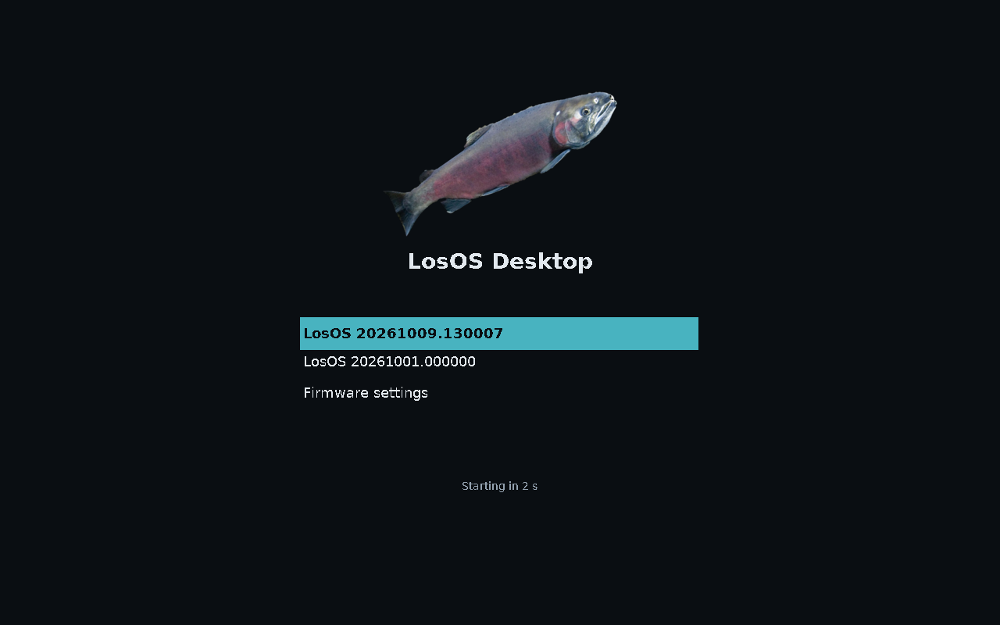
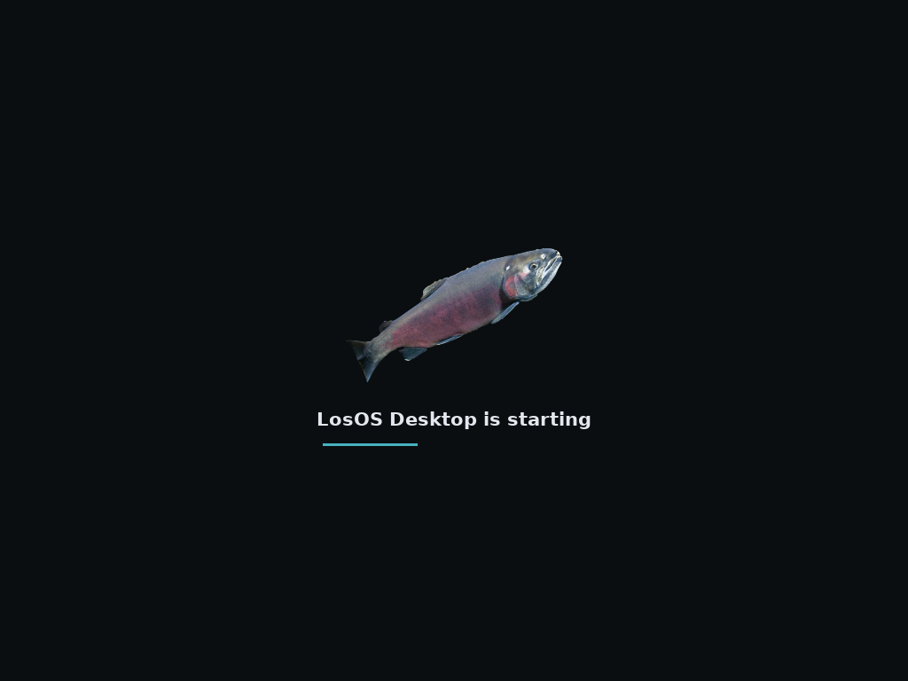

# Boot loader and boot screen

LosOS boots with GRUB on every PC: from the ESP on UEFI, and from the MBR on
an x86_64 PC that starts by legacy BIOS (or by UEFI's Compatibility Support
Module, with UEFI turned off). One disk carries both, so the same image, the
same install and the same updates start on either kind of firmware. Both
draw the same menu, with the salmon LosOS boots behind, and hand over to
the same Plymouth splash. arm64 has no BIOS, so only the UEFI half applies
to it.

```
UEFI   firmware -> ESP: GRUB -> chainloads the newest UKI -> systemd-stub
BIOS   firmware -> MBR: GRUB's boot.img -> BIOS boot partition: GRUB's core
              -> the newest UKI's kernel, initrd and command line
then   the systemd initrd, under Plymouth -> the login screen
```


Under either firmware GRUB finds the same versions on the ESP, counts the
tries of a new one, and falls back to the older one, so the two `/usr`
slots and rollback work the same.

## What it looks like



The menu, the splash systemd-stub shows while the kernel loads, and the
Plymouth splash are drawn from one picture, `nixos/branding/salmon.png`:
the same coho salmon, cut out of a NOAA Fisheries photo, that LosOS
itself boots behind (`nixos/branding/CREDITS.md`). Every picture is made
from it at build time (`nixos/branding/default.nix`), on the dark palette
derisk and LosOS's WebUI share, so replacing that file replaces all of them.

- **GRUB** (`nixos/branding/default.nix`'s `grub/`): the salmon, the
  system's name, the menu with the chosen entry in the accent colour, and a
  countdown. On UEFI GRUB uses the screen's own mode; on a BIOS 1024x768,
  which Linux keeps as its framebuffer. Without a mode GRUB can set, the
  menu is text. It is also written to the first serial port.
- **systemd-stub**: the UKI's `.splash`, the salmon and the name on black,
  centred while the kernel and initrd load, so the screen does not go dark
  between GRUB and Plymouth (`nixos/modules/splash.nix`).
- **Plymouth** (`nixos/branding/splash.script`): the salmon in the middle of
  the screen, "LosOS Desktop is starting" under it and a line that grows as
  the boot gets on. A password or a question takes the caption's place. At
  shutdown it says "is restarting" or "is shutting down". It runs from the
  initrd until the login screen takes the display, and leaves its last frame
  there for the greeter to draw over. Esc shows the boot log.



The kernel prints errors only (`loglevel=3`), systemd prints its status
lines only when a unit fails or the boot stalls (`systemd.show_status=auto`),
and Plymouth keeps even those behind Esc; every message is still in the
journal.

The [installer ISO](installer.md) looks the same, but says "LosOS Desktop
installer". Halium phones boot through Android's boot loader and draw
nothing until the compositor starts, so none of this is on them.

## What is on the disk

```
MBR, first 440 bytes                GRUB's boot.img (UEFI ignores it)
BIOS boot partition, 1 MiB          GRUB's core.img, its modules, menu and theme inside
ESP
  EFI/BOOT/BOOTX64.EFI              GRUB, its modules, menu and theme inside
  EFI/losos/grubx64.efi             the same, where a boot entry can name it
  EFI/losos/grubenv                 GRUB's boot counter
  EFI/Linux/losos-desktop_<v>.efi     the UKI, version <v>
  EFI/Linux/losos-desktop_<v>.linux   its kernel (x86_64, for a BIOS)
  EFI/Linux/losos-desktop_<v>.initrd  its initrd (x86_64, for a BIOS)
  EFI/Linux/losos-desktop_<v>.grub    its command line, as a line of GRUB script
```

The image (`image.nix`, `system.build.disk`) and the
[installer ISO](installer.md) both lay out the BIOS boot partition and write
GRUB into it, with `losos-grub-bios-install` from `nixos/modules/bios.nix`.
The [Windows installer](windows-installer.md) does not: it adds LosOS
beside Windows on a UEFI PC only.

UEFI GRUB chainloads the UKI, so systemd-stub runs as it would under any
loader: it measures the UKI into the TPM (which
[hibernation](hibernation.md) seals its key to), shows its splash and starts
the kernel with the command line built in. GRUB's `bli` module sets the
EFI variables systemd-boot used to set, `LoaderDevicePartUUID` and
`LoaderInfo`, so `systemd-gpt-auto-generator` finds the root disk and
mounts the ESP from them as before.

BIOS GRUB cannot run a UKI, which is an EFI program. So every release
carries each UKI's kernel, initrd and command line as files of their own,
cut from the finished UKI, and sysupdate installs them beside it as part of
the same version (`bios.nix`'s transfers). The command line is the UKI's
with one change: `root=gpt-auto` becomes `root=PARTLABEL=root-x86-64`,
because systemd finds the root partition from `LoaderDevicePartUUID`, an EFI
variable a BIOS has none of. Likewise a small generator mounts the root
disk's ESP at `/efi` on a BIOS boot, which `systemd-gpt-auto-generator`
does only under UEFI.

Nothing on a running system rewrites GRUB, as with any image-based system:
the loader on the disk is the one the image or installer put there
([What is not done](not-done.md)). NixOS's own GRUB module, which installs
GRUB and regenerates its menu on every rebuild, stays off; this OS is never
rebuilt in place.

UEFI used to boot with systemd-boot. It draws a text menu in the firmware's
font and nothing else, and two loaders counting tries in two places were one
more thing to keep in step, so GRUB took its place. A disk installed before
then still starts systemd-boot from its ESP, and still boots every update
and rolls back as it did; `losos-grub-bless` and the hibernation hook leave
such a boot to systemd-boot's own tools.

## GRUB's menu

GRUB's menu (`nixos/modules/grub.cfg`) is built into GRUB's image, with the
theme beside it and only the modules they use (`nixos/modules/grub-image.nix`),
so GRUB reads nothing of its own from a filesystem but `grubenv`. It is not
generated per machine. Each time it is drawn, it looks for
`EFI/Linux/losos-desktop_*.efi` on every partition of the disk GRUB was
started from (on a BIOS, only those with a kernel beside them), and offers:

1. the newest UKI that still has tries left, as the default;
2. every other one, with "(failed to start)" beside one that used up its
   tries;
3. on UEFI, Windows Boot Manager when it is on the same disk, and the
   firmware's own settings when the firmware can be asked to open them.

## Boot counting

sysupdate installs a UKI with three tries in its name,
`losos-desktop_<v>+3-0.efi` (`update.nix`). GRUB cannot rename a file, so it
keeps the count in `grubenv`:

- The first boot of a counted UKI starts its trial: GRUB records its name in
  `losos_entry` and the tries its name gives in `losos_left`.
- Every boot of it lowers `losos_left` by one, before GRUB starts it.
- At zero, GRUB passes over it and starts the next-newest version instead.


`losos-grub-bless.service` is the userspace half, ordered after
`boot-complete.target` as `systemd-bless-boot.service` is. It settles the
trial in the file name, where sysupdate reads it:

- the UKI on trial is the one that booted: renamed to
  `losos-desktop_<v>.efi`, blessed;
- its tries ran out and an older version booted: renamed to
  `losos-desktop_<v>+0-3.efi`, the name systemd-boot leaves on an entry that
  used up its tries, so it stays last in the menu.

Either way `grubenv` is emptied, so a disk moved to another machine
mid-trial carries on from the file names.

`grubenv` also holds `losos_oneshot`, a version to start the next time
instead of the newest, once, as `bootctl set-oneshot` did. The hibernation
hook sets it, so the machine resumes into the kernel that hibernated even
if an update arrived meanwhile ([Hibernation](hibernation.md)).

## The installer ISO

The [installer ISO](installer.md) starts with GRUB too, with the same theme
and one entry, which finds the medium by its label. On UEFI, GRUB is the
ISO's removable-media boot path and chainloads the installer's UKI from the
ISO 9660 filesystem. On an x86_64 BIOS, GRUB's El Torito image starts it
from a disc, and GRUB's hybrid MBR starts the same image from a stick; it
starts the installer's kernel and initrd, kept beside its UKI in `boot/`,
with the UKI's command line. Plymouth then shows "LosOS Desktop installer
is starting" until the installer takes the screen.

## Secure Boot

Secure Boot is UEFI's and does not apply to a BIOS boot. On UEFI neither
GRUB nor the UKIs are signed, so Secure Boot must be off
([What is not done](not-done.md)).

## Tested

`nix flake check` boots the image under UEFI (`checks.x86_64-linux.boot`):
GRUB chainloads the UKI, `LoaderInfo` names GRUB, first boot lays out the
disk, and the test then renames the UKI to the name sysupdate gives a new
one, reboots, and checks the trial ended with the file blessed and
`grubenv` empty. `boot-bios` does the same under QEMU's SeaBIOS, where GRUB
starts the UKI's kernel and the ESP is mounted without EFI to name it.
`hibernate` checks the one-shot request is spent on resume.
`installer-boot` and `installer-boot-bios` start the installer ISO under
each firmware.

Both GRUB images were also started under QEMU, OVMF and SeaBIOS, from a
disk with two versions on it, one on trial: each drew the themed menu,
counted the trial down in `grubenv`, honoured a one-shot request, and on
UEFI left `LoaderInfo` as "GRUB 2.14" and `LoaderDevicePartUUID` as the
ESP's for the UKI it chainloaded.
