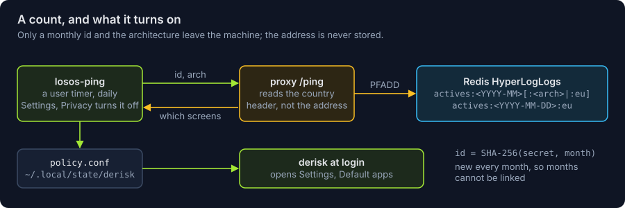
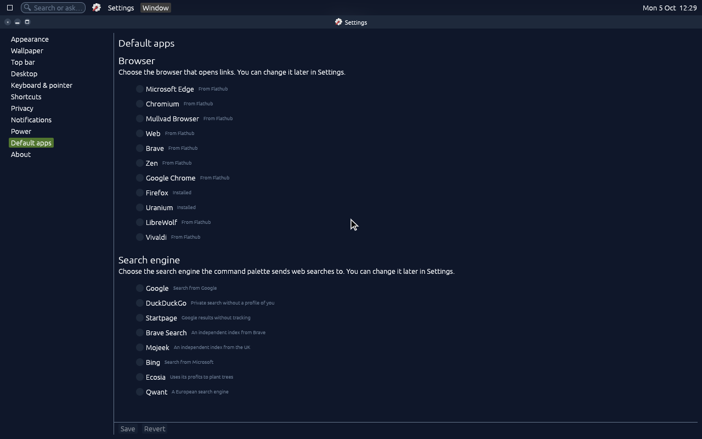

# Active users and the choice screens

The EU's Digital Markets Act makes an operating system with 45 million
monthly active end users in the EU a gatekeeper (Art. 3(2)(b)), and a
gatekeeper has to show users in the EEA a choice screen for the browser and
the search engine (Art. 6(3)). derisk has both screens and keeps them
hidden. What turns them on is a count of active users, so the OS has one.

**What is sent.** `nixos/modules/ping.nix` gives every signed-in user a
systemd user timer, `losos-ping`, that runs a few minutes into each session
and then daily. It POSTs two lines to `$LOSOS_PROXY_URL/ping`: `id`, the
SHA-256 of a random secret in `~/.local/state/losos/ping-secret` and the
current month, and `arch`. The id changes every month, so the proxy can
count a person once a month and cannot link one month to the next. Nothing
else is sent: no account, no hardware id, no version. A user turns it off
in Settings, Privacy ("Count me as an active user"), which writes
`privacy.usage_ping = false`; `losos.ping.enable = false` turns it off for
a build, and a build without `LOSOS_PROXY_URL` has no timer.

**What is counted.** `proxy/` adds the id to the month's HyperLogLog in
Redis (`actives:<YYYY-MM>`, and `actives:<YYYY-MM>:<arch>`), and, when
Vercel's `x-vercel-ip-country` header names an EU member state, to
`actives:<YYYY-MM>:eu` and the day's `actives:<YYYY-MM-DD>:eu`. Month keys
are kept for 100 days and day keys for 3. Only that country code
is read, to pick the keys; the address is never read or stored, and a
HyperLogLog cannot give an id back. Each size is the larger of the current
period's EU count and the one before, so a new month or day does not start
from zero.

**What comes back.** `{"region":"eu","choice_screens":{"browser":…,"search":…}}`,
both on for a request from the EEA (the EU, Iceland, Liechtenstein,
Norway) once either EU count reaches its threshold, and off everywhere
else. The script turns it into
`~/.local/state/derisk/policy.conf`, which derisk reads: with a screen on
and nothing chosen yet, derisk opens Settings on its Default apps page at
login, and the page stays in Settings after. Both screens list their
options in a new random order each time, with none preselected; the browser
screen offers the installed browsers and installs others from Flathub.

To set it up, add a Redis database to the Vercel project from the
Marketplace (Upstash), which sets `KV_REST_API_URL` and `KV_REST_API_TOKEN`
(`UPSTASH_REDIS_REST_URL` and `UPSTASH_REDIS_REST_TOKEN` work too). Without
one, pings are answered with both screens off and nothing is counted.
`CHOICE_SCREENS_AT` sets the monthly threshold (default 45000000),
`CHOICE_SCREENS_DAILY_AT` a threshold in daily EU pings by distinct user
(none by default), and
`CHOICE_SCREENS=on` or `off` forces both screens either way, for testing or
by choice. The counts are read with `PFCOUNT actives:<YYYY-MM>:eu` (or without
`:eu`, for everyone) in the database's console. Where a person is comes
from their address at the time of the ping, not from a setting on the
machine, so a VPN moves them.
