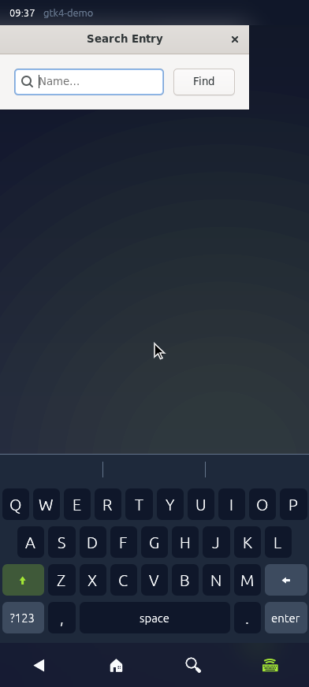

# GTK and Qt on a phone

GTK and Qt applications are written for a desktop: dialogs open at a
desktop size, the GTK3 file chooser puts a sidebar beside its file list, and
a finger on a Qt list selects instead of scrolling. On a phone that means
windows that run off the screen. The overlay (`nixos/pkgs/default.nix`)
replaces `gtk3`, `gtk4` and Qt 6's `qtbase` with patched builds, so every
package that links them gets the patched toolkit, on the PC and on Halium.

Every patch decides for itself whether it is on a phone: it is when every
screen is under 600 logical pixels on its short side, the line derisk's
shell draws between its phone and tablet layouts (`src/adaptive.rs` in
derisk). A phone docked to a monitor is then a desktop again, and a PC
behaves as stock. The one exception is Qt's touch scrolling, which follows a
touchscreen rather than a screen size.

- **GTK3** carries Purism's adaptive series, the one PureOS and Mobian ship
  on phones: an adaptive file chooser (which xdg-desktop-portal-gtk shows for
  every application that asks the portal for a file), about, print, font and
  shortcuts windows that fit a phone, maximized dialogs, a back button in
  dialog header bars, message dialogs with stacked buttons, and touch event
  fixes. It copies a few libhandy widgets into GTK to build those. Purism
  turns it on with an `org.gtk.Settings.Purism` `is-phone` key per device;
  `0033` adds the screen-size check, and the key still forces it on.
- **GTK4** carries Purism's three: resizable dialogs and transient windows
  open maximized and get only a close button. postmarketOS carried the same
  two until libadwaita 1.5, whose `AdwDialog` and breakpoints adapt on their
  own, so libadwaita needs nothing; the patches are for plain GTK4 windows,
  such as gcr's prompts. `0004` is the screen-size check.
- **Qt 6** has no phone patches anywhere to adopt: Plasma Mobile adapts in
  Kirigami and its own shell. Both are this repository's. A finger scrolls
  any Qt Widgets scroll area kinetically through `QScroller`, which
  `QAbstractScrollArea` already supported but left to each application to
  turn on; `QT_TOUCH_SCROLLER=0` turns it off for an application that draws
  with a finger. On a phone, resizable dialogs open maximized, and the
  minimum size a window asks the compositor for is capped at the screen.
  Since Qt 6.10 the Wayland client is part of qtbase, so `qtwayland` is left
  stock. Qt 5, which nothing in the image links, gets no phone patches, only
  the icon theme one ([One icon theme](icon-theme.md)).

Each patched toolkit links with [mold](https://github.com/rui314/mold)
instead of nixpkgs' default `ld.bfd`, and compiles through ccache. The
overlay applies its patches through one helper, `withPatches`, which also
builds the package with nixpkgs' `stdenvAdapters.useMoldLinker` and
`ccacheStdenv`, so a package patched later gets both without being listed
anywhere. The mold adapter puts `ld.mold` in the compiler wrapper and adds
`-fuse-ld=mold`, so configure probes and libtool link with mold as well as
the final link. ccache is used only where the builder binds a cache
directory to `/var/cache/losos-ccache`, so the derivation is the same with
or without one. CI's `prebuild` job keeps it in GHCR as
`losos-ccache:<arch>` and fetches it through the proxy, so a GTK or Qt point
release, or a changed patch, recompiles only the files it changes: a second
GTK3 build took 832 of its 835 objects from the cache and finished in 3m44s
instead of 6m35s, with a bit-for-bit identical output. These packages
compile in CI anyway, so neither costs a cache hit. What links against them
keeps nixpkgs' stdenv, since changing it for every package would mean
nothing substituting from cache.nixos.org at all.

The on-screen keyboard is derisk's. GTK3, GTK4 and Qt 6 all speak Wayland's
`text-input-unstable-v3` without patches, so the keyboard can follow text
focus once derisk's compositor offers that protocol.

What it costs: a patched toolkit no longer substitutes from
cache.nixos.org, and neither does anything built against it. In this image
that is GTK3 and GTK4, Qt 6's qtbase, qtdeclarative, qtsvg, qttools and
qtshadertools (qtbase links GTK3 for its GTK platform theme, and
breeze-icons, which papirus-icon-theme builds against, needs Qt), and
gjs, gcr, gnome-keyring, gnome-desktop, gnome-settings-daemon, libsecret,
xdg-desktop-portal and its GTK backend, ostree, flatpak and geoclue: about
thirty derivations per architecture. CI's `prebuild` job builds them before
the release build starts (`tools/nix-prebuild-plan` finds them: every
derivation the release needs that does not change with `losos.version`, so
nothing lists them by name), pushes them to the project's
cache, and hands them to the release build in the same run, which checks
that none of them is left to compile. Later runs substitute them from the
cache until nixpkgs moves GTK or Qt. Flatpak applications run on their runtime's own GTK and Qt
and do not get these patches.

When nixpkgs moves GTK or Qt and a patch stops applying, the build fails at
that patch. Purism rebases the GTK series for each Debian release;
refreshing means copying the series from `pureos/latest` again and
rebasing the two `Treat a display of phone-sized monitors` patches.
