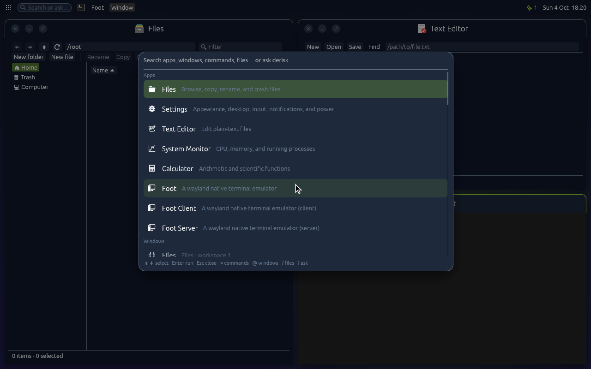

# One icon theme

Every app draws its icons from the icon theme derisk's theme names
(Papirus-Dark or Papirus by default; Settings, Appearance), not from one it
ships or names in code. Two halves make that hold.

derisk hands the name to every toolkit, through the channel each already
reads (`src/theme.rs` in derisk):

- **GTK 3 and 4** read `gtk-icon-theme-name` from `settings.ini` on the XDG
  config path, which derisk publishes, but prefer GSettings'
  `org.gnome.desktop.interface icon-theme` whenever the GNOME schemas are
  installed, as they are for any app nixpkgs wraps. So derisk also writes
  that key with `dconf`, which `programs.dconf` provides
  (`nixos/modules/desktop.nix`); without it GSettings answers its default,
  Adwaita, and GTK apps ignored derisk's theme. Running apps follow a change.
- **Qt 5 and 6** ask their platform theme, which in a session that is
  neither GNOME nor Plasma names no icon theme, so Qt apps had only
  hicolor's few icons. Both read `QT_QPA_SYSTEM_ICON_THEME` first, and derisk
  sets it in every app it launches and in the user manager's and D-Bus
  activation's environment. A running Qt app keeps the theme it started
  with.
- **Flatpak apps** see the host's icon themes at `/run/host/share/icons`
  (nixpkgs' flatpak binds `/run/current-system/sw/share/icons` there), and
  their GTK asks the settings portal for the name, which the GTK backend
  answers from the same GSettings key.

The toolkits then refuse an app's attempt to replace it, in the overlay's
patches (`nixos/pkgs/patches`, `gtk3/0034`, `gtk4/0005`, `qtbase/0003`,
`qtbase5/0001`):

- GTK ignores `gtk-icon-theme-name` set by the application on
  `GtkSettings`, or by a GTK theme's own `settings.ini`. Only the desktop's
  settings and the user's `~/.config/gtk-*/settings.ini` choose it.
  `gtk_icon_theme_set_custom_theme()` (GTK 3) and
  `gtk_icon_theme_set_theme_name()` (GTK 4) already refused the display's
  icon theme.
- Qt ignores `QIcon::setThemeName()` while the system names a theme. The
  name the app asked for becomes its fallback theme instead, unless it set
  one, so an icon only its own theme has still shows. This is how KDE apps
  ask for Breeze on every desktop but Plasma.
- In both, the system's icon directories always lead the search path,
  whatever the app sets or prepends, so an app cannot shadow the system
  theme with a directory of the same name or drop the directories it lives
  in. App directories still follow, and icons in an app's own resources stay
  hicolor-level fallbacks, as the icon theme specification has them.

What is left: an app that loads an image file or resource by path instead of
asking for an icon by name gets that image, since there is no name to look
up. Chromium and Electron draw their own UI icons that way and use GTK only
for file icons and the file chooser, which follow the theme. Flatpak apps
run on their runtime's unpatched GTK and Qt, so one can still name its own
theme in code; KDE runtime apps, which carry Breeze and never read
`QT_QPA_SYSTEM_ICON_THEME` from the host, keep Breeze.
