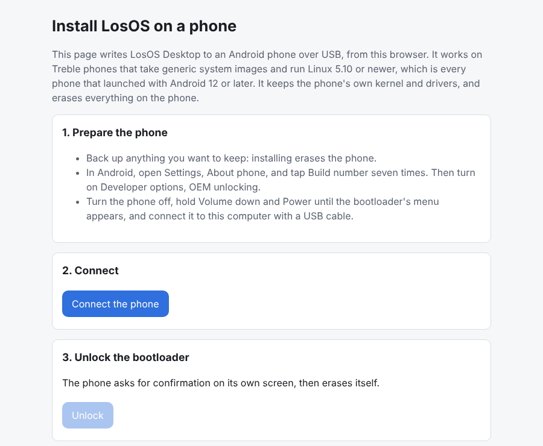
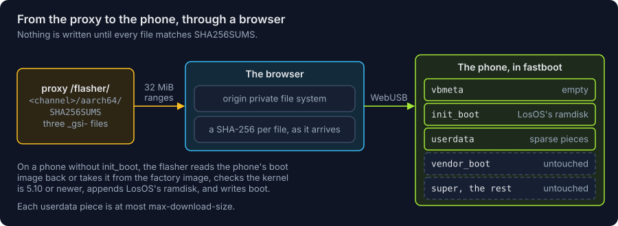

# Web flasher

The flasher installs the [Halium GSI](halium.md) on a phone from a browser,
over WebUSB, the way GrapheneOS's web installer does for Pixels. It is the
Flasher link in the docs site's navigation bar: plain HTML and JavaScript in
`website/static/flasher/`, which Docusaurus copies to `flasher/` on the site,
with no build step and no third-party code.

It needs a Chromium-based browser on a computer (Chrome, Edge, Brave), since
only those implement WebUSB, and a phone whose bootloader can be unlocked,
that takes GSIs, and that runs Linux 5.10 or newer (launched with Android 12
or later).

## What it does

1. **Connect.** The person puts the phone in its bootloader (Volume down and
   Power) and picks it from the browser's USB prompt, which lists only
   devices with a fastboot interface. The flasher reads `product`,
   `unlocked`, `current-slot`, whether it is in fastbootd (`is-userspace`),
   and whether `init_boot` and `vbmeta` exist.
2. **Unlock.** For a locked bootloader it sends `flashing unlock`; the phone
   asks on its own screen and erases itself. OEM unlocking has to be turned
   on in Android's developer options first, which only the phone can do.
3. **The phone's boot image**, only on a phone without `init_boot`. The
   flasher needs the boot image the phone runs. "Read it from the phone"
   restarts the phone into fastbootd (`reboot-fastboot`), the fastboot
   inside recovery, which unlike the bootloader can read a boot partition
   back (`fetch`, in `max-fetch-size` pieces); the person connects again
   and it reads `boot_<slot>`. Alternatively the person chooses `boot.img`
   from the factory image of the exact build the phone runs. Either way the
   flasher (`bootimg.js`) parses the header, reads `Linux version x.y.z`
   from the kernel (raw, gzip with device trees after it, or LZ4), and
   refuses a kernel older than 5.10.
4. **Get LosOS.** It reads the newest release's `SHA256SUMS` from the proxy,
   finds the three `_gsi-` files in it by name, and downloads them into the
   browser's private file storage (the origin private file system), hashing
   as they arrive. A file whose SHA-256 differs from `SHA256SUMS` stops the
   install. Files the person already has (a local `nix build .#gsi`, say)
   can be chosen instead, and are checked when `SHA256SUMS` is among them.
5. **Install.** It writes `vbmeta` (when the phone has one) and `init_boot`
   to the current slot, then `userdata`. On a phone without `init_boot` it
   writes `boot` instead: the phone's boot image with the GSI's ramdisk,
   taken out of the release's `init_boot.img`, appended to its own at a
   4-byte boundary (recompressed with gzip when the phone's is gzip), and
   the header's ramdisk size, `recovery_dtbo` offset and SHA-1 id written
   as `mkbootimg` would; a v4 header's boot signature is dropped, since
   vbmeta turns verification off. A result larger than the partition stops
   the install. userdata's own image is gigabytes, and a bootloader takes at most
   `max-download-size` at a time, so the flasher decompresses it as a stream
   and cuts it into sparse images of at most that size (256 MiB at most),
   each covering the whole partition with "skip" chunks around its own share,
   as fastboot's own resparsing does. They are written one after another.
6. **Start.** `reboot`. The first boot grows the root filesystem to the whole
   of userdata.

It writes nothing else. The phone's kernel, `vendor_boot`, `super` and every
other partition are left as they were, which is what makes one image fit
every phone.

The bootloader cannot be relocked over this: no bootloader outside Pixels takes
another signing key, and a Pixel's would have to sign `init_boot` and vbmeta
for LosOS. Every start shows the bootloader's unlocked warning.

## Where the files come from

The aarch64 release carries the GSI's files (`flake.nix`, `release`), so they
are pushed, signed and tagged with the rest of it. The flasher reads them from
`<proxy>/flasher/<channel>/aarch64/<file>`.

The proxy serves `/updates/` to sysupdate as redirects to GHCR's storage, but
a page can only read a response from another origin that says
`Access-Control-Allow-Origin`, and GHCR's storage does not. So `/flasher/`
serves the same release, limited to the `_gsi-` files and `SHA256SUMS`, by
streaming each byte range the flasher asks for through the proxy. The
flasher asks for 32 MiB at a time, so no request comes near the function's
time limit. Those bytes count against the proxy's Vercel bandwidth, unlike
`/updates/`, whose bytes never pass through it. Every read the proxy answers
now carries `Access-Control-Allow-Origin: *`, since all of it is public and
none of it uses cookies; `/ping` does not.

The proxy's address reaches the page the way it reaches the image: CI has it
as the repository variable `LOSOS_PROXY_URL`, `docs.yml` passes it to the
site build, and the build writes it to `flasher/config.json`. A build without
it (`npm start`) still installs from files on the computer.

The SHA-256 check is against the `SHA256SUMS` the same proxy serves. It
catches a broken download; it does not check the release's OpenPGP
signature, which the browser has no key for.
